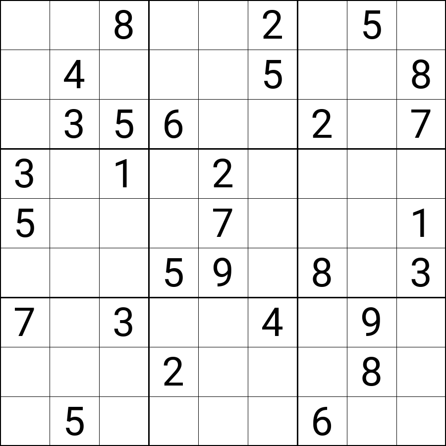

# sugoku

Simple sudoku solver using backtracking w/ a neat GUI to better display the algorithm's inner-workings.

*Note: the time `sugoku` takes to solve a board with the GUI is significantly slower than without one, due to the capped framerate and blocking channels*



## How to start

```sh
$: go run cmd/gui/main.go # click anywhere on the screen to start the solving
$: go run cmd/cli/main.go
```

## TODO

- [x] Don't force concurrency

# Requirements

Our GUI uses [go-sdl2](https://github.com/veandco/go-sdl2) which in turn relies on the following:

- [SDL2](http://libsdl.org/download-2.0.php)
- [SDL2_image (optional)](http://www.libsdl.org/projects/SDL_image/)
- [SDL2_mixer (optional)](http://www.libsdl.org/projects/SDL_mixer/)
- [SDL2_ttf (optional)](http://www.libsdl.org/projects/SDL_ttf/)
- [SDL2_gfx (optional)](http://www.ferzkopp.net/wordpress/2016/01/02/sdl_gfx-sdl2_gfx/)

Below is some commands that can be used to install the required packages in
some Linux distributions. Some older versions of the distributions such as
Ubuntu 13.10 may also be used but it may miss an optional package such as
_libsdl2-ttf-dev_ on Ubuntu 13.10's case which is available in Ubuntu 14.04.

On **Ubuntu 14.04 and above**, type:\
`apt install libsdl2{,-image,-mixer,-ttf,-gfx}-dev`

On **Fedora 25 and above**, type:\
`yum install SDL2{,_image,_mixer,_ttf,_gfx}-devel`

On **Arch Linux**, type:\
`pacman -S sdl2{,_image,_mixer,_ttf,_gfx}`

On **Gentoo**, type:\
`emerge -av libsdl2 sdl2-{image,mixer,ttf,gfx}`

On **macOS**, install SDL2 via [Homebrew](http://brew.sh) like so:\
`brew install sdl2{,_image,_mixer,_ttf,_gfx} pkg-config`

On **Windows**,

1. Install mingw-w64 from [Mingw-builds](http://mingw-w64.org/doku.php/download/mingw-builds)
   - Version: latest (at time of writing 6.3.0)
   - Architecture: x86_64
   - Threads: win32
   - Exception: seh
   - Build revision: 1
   - Destination Folder: Select a folder that your Windows user owns
2. Install SDL2 http://libsdl.org/download-2.0.php
   - Extract the SDL2 folder from the archive using a tool like [7zip](http://7-zip.org)
   - Inside the folder, copy the `i686-w64-mingw32` and/or `x86_64-w64-mingw32` depending on the architecture you chose into your mingw-w64 folder e.g. `C:\Program Files\mingw-w64\x86_64-6.3.0-win32-seh-rt_v5-rev1\mingw64`
3. Setup Path environment variable
   - Put your mingw-w64 binaries location into your system Path environment variable. e.g. `C:\Program Files\mingw-w64\x86_64-6.3.0-win32-seh-rt_v5-rev1\mingw64\bin` and `C:\Program Files\mingw-w64\x86_64-6.3.0-win32-seh-rt_v5-rev1\mingw64\x86_64-w64-mingw32\bin`
4. Open up a terminal such as `Git Bash` and run `go get -v github.com/veandco/go-sdl2/sdl`.
5. (Optional) You can repeat **Step 2** for [SDL_image](https://www.libsdl.org/projects/SDL_image), [SDL_mixer](https://www.libsdl.org/projects/SDL_mixer), [SDL_ttf](https://www.libsdl.org/projects/SDL_ttf)
   - NOTE: pre-build the libraries for faster compilation by running `go install github.com/veandco/go-sdl2/{sdl,img,mix,ttf}`

- Or you can install SDL2 via [Msys2](https://msys2.github.io) like so:
  `pacman -S mingw-w64-x86_64-gcc mingw-w64-x86_64-SDL2{,_image,_mixer,_ttf,_gfx}`

## Shoutouts

[viktordanov](https://github.com/viktordanov)
